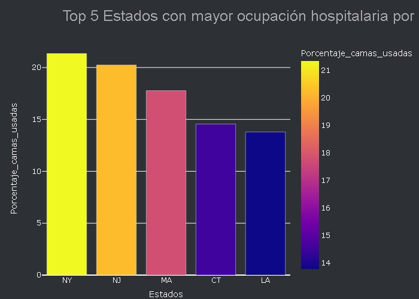

# Proyecto Análisis COVID-19 segun CDCC (centro de control y prevención de enfermedades) de EE. UU. 

La COVID-19 afecta de distintas maneras en función de cada persona. La mayoría de las personas que se contagian presentan síntomas de intensidad leve o moderada, y se recuperan sin necesidad de hospitalización, sin embargo se tuvo una alta tasa de mortalidad en el país (EEUU).Por esto ha contratado a nuestra consultora para organizar, en base a los datos recolectados, los recursos hospitalarios para prevenir que lo ocurrido durante la pandemia COVID-19 suceda de vuelta.

___________

### 1 - ¿Cuáles fueron los 5 Estados con mayor ocupación hospitalaria por COVID? Criterio de ocupación por cama común. Considere la cantidad de camas ocupadas con pacientes confirmados y tome como referencia los 6 primeros meses del 2020 - recuerde incluir la cifra de infectados en esos meses (acumulativo). ¿Influye el rango etario en este comportamiento?

| Nombre estadi       | Estado   |   Porcentaje_camas_usadas %  |
|:-----------------|:--------|--------------------------:|
| Nueva York[19]​   | NY      |                   21.3473 |
| Nueva Jersey[17]​ | NJ      |                   20.2405 |
| Massachusetts    | MA      |                   17.7679 |
| Connecticut      | CT      |                   14.5507 |
| Luisiana[10]​     | LA      |                   13.7848 |

 