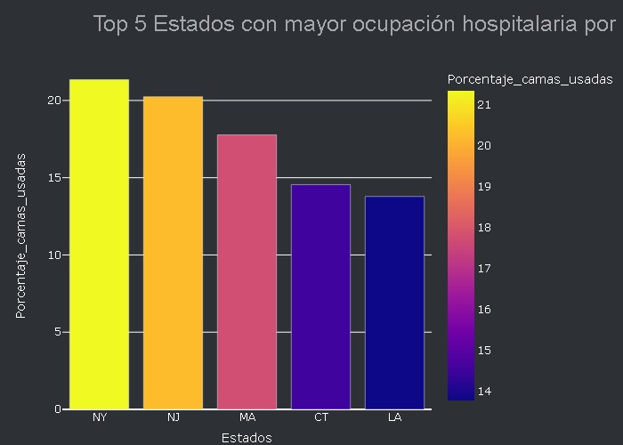
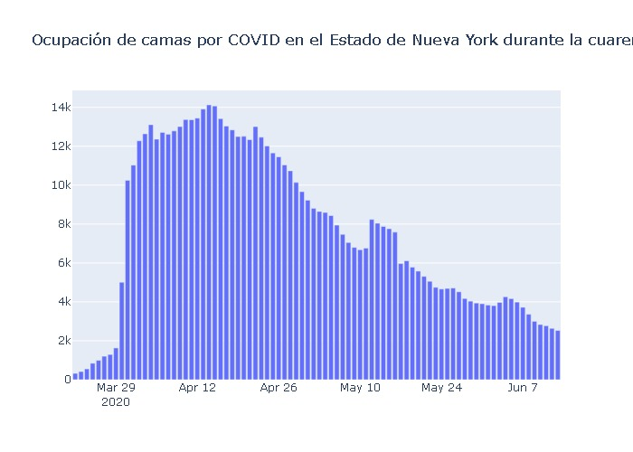
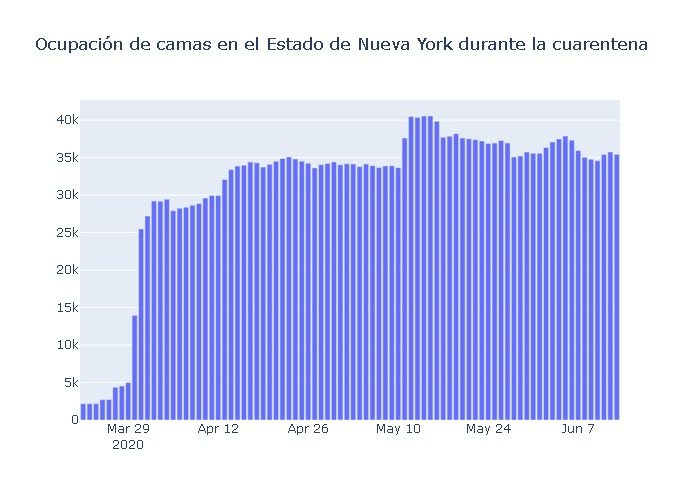
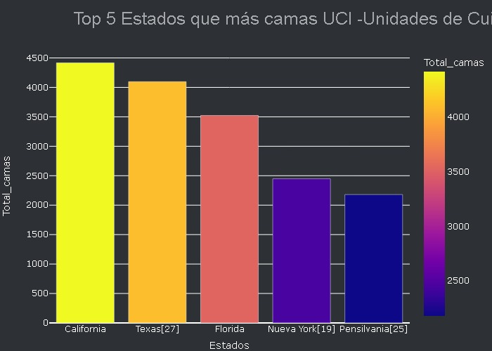
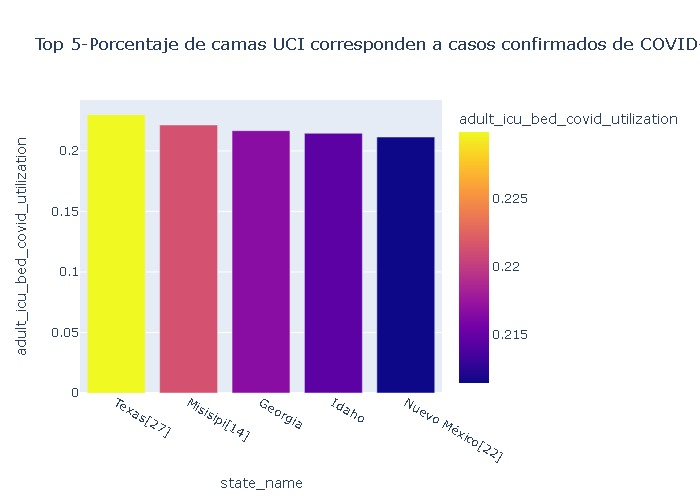
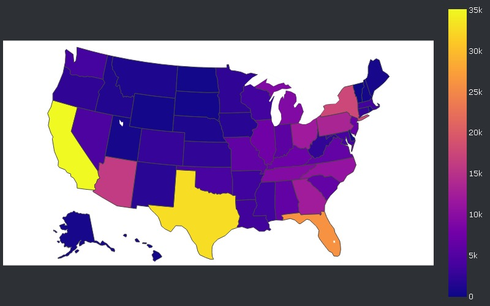
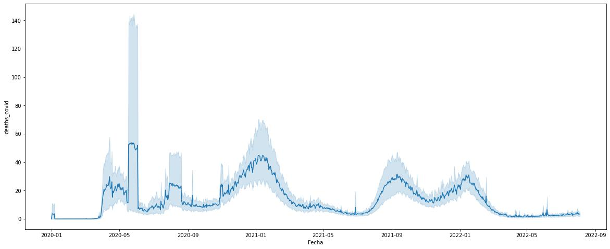
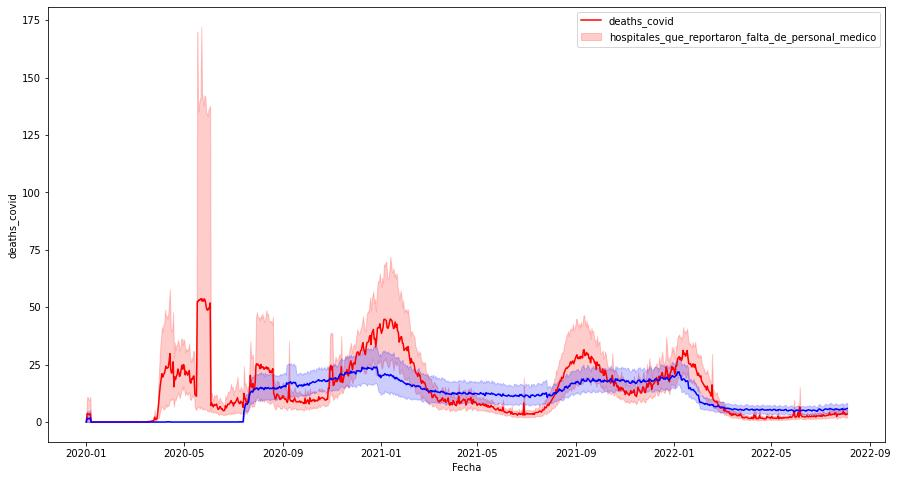

# Proyecto Análisis COVID-19 segun CDCC (centro de control y prevención de enfermedades) de EE. UU. 

La COVID-19 afecta de distintas maneras en función de cada persona. La mayoría de las personas que se contagian presentan síntomas de intensidad leve o moderada, y se recuperan sin necesidad de hospitalización, sin embargo se tuvo una alta tasa de mortalidad en el país (EEUU).Por esto ha contratado a nuestra consultora para organizar, en base a los datos recolectados, los recursos hospitalarios para prevenir que lo ocurrido durante la pandemia COVID-19 suceda de vuelta.

___________

### 1 - ¿Cuáles fueron los 5 Estados con mayor ocupación hospitalaria por COVID? Criterio de ocupación por cama común. Considere la cantidad de camas ocupadas con pacientes confirmados y tome como referencia los 6 primeros meses del 2020 - recuerde incluir la cifra de infectados en esos meses (acumulativo). ¿Influye el rango etario en este comportamiento?

| Nombre estado       | Estado   |   Porcentaje_camas_usadas %  |
|:-----------------|:--------|--------------------------:|
| Nueva York[19]​   | NY      |                   21.3473 |
| Nueva Jersey[17]​ | NJ      |                   20.2405 |
| Massachusetts    | MA      |                   17.7679 |
| Connecticut      | CT      |                   14.5507 |
| Luisiana[10]​     | LA      |                   13.7848 |

 

___________

### 2 - Analice la ocupación de camas (Común) por COVID en el Estado de Nueva York durante la cuarentena establecida e indique:

* Intervalos de crecimiento y decrecimiento
* Puntos críticos (mínimos y máximos)

 

Se puede ver como al principio hubo una exploción de casos de COVID (sobre todo desde el 02 de abril hasta el 24 de abril del 2020 que superaron las 12.000 camas ocupadas) que luego fue progresivamente disminuyendo. La máxima ocupación de camas de COVID fue 14126.0 y la mínima ocupación de camas de COVID fue 324.0
La mínima ocupación de camas de casos COVID confirmados fue el día 1412   2020-03-22

 

Pero a pesar de que la mínima y máxima son parecidas (la máxima ocupación de camas fue 40559.0 y la mínima ocupación camas fue 2171.0 ), la saturación del sistema de salud que se había gestado a partir de la pandemia continuo. Apenas disminuyó el uso de camas comunes, como se puede ver en el segundo gráfico.

___________

### 3 - ¿Cuáles fueron los cinco Estados que más camas UCI -Unidades de Cuidados Intensivos- utilizaron durante el año 2020? La medición debe realizarse en términos absolutos.

Estados que más camas UCI -Unidades de Cuidados Intensivos- utilizaron durante el año 2020 
 |    | state_name      | state   |   total_icu_bed_use |   Total_camas |
|---:|:----------------|:--------|--------------------:|--------------:|
California      | CA      |         1.12194e+06 |          4417 |
Texas[27]​       | TX      |         1.04056e+06 |          4097 |
Florida         | FL      |    894830           |          3523 |
Nueva York[19]​  | NY      |    621846           |          2448 |
Pensilvania[25]​ | PA      |    553670           |          2180 |

 

___________

### 4 - ¿Qué cantidad de camas se utilizaron, por Estado, para pacientes pediátricos con COVID durante el 2020?

Los estados que ocuparon mas camas pediatricos 
 |    | state_name      | state   |   all_pediatric_inpatient_bed_occupied |   Total_camas_pediatricos |
|---:|:----------------|:--------|---------------------------------------:|--------------------------:|
|  4 | California      | CA      |                                 483142 |                      1902 |
| 33 | Nueva York[19]​  | NY      |                                 440362 |                      1734 |
| 37 | Pensilvania[25]​ | PA      |                                 280480 |                      1104 |
| 13 | Illinois        | IL      |                                 274279 |                      1080 |
| 21 | Míchigan[13]​    | MI      |                                 233298 |                       918 |
| 34 | Ohio            | OH      |                                 212064 |                       835 |
|  8 | Florida         | FL      |                                 199158 |                       784 |
| 23 | Misuri[15]​      | MO      |                                 198208 |                       780 |
| 14 | Indiana         | IN      |                                 159654 |                       629 |
| 22 | Minnesota       | MN      |                                 138385 |                       545 |

 

___________

### 5 - ¿Qué porcentaje de camas UCI corresponden a casos confirmados de COVID-19? Agrupe por Estado.

 Estados que ocuparon (%) mas camas UCI:: 
|    | state_name       | state   |   adult_icu_bed_covid_utilization |
|---:|:-----------------|:--------|----------------------------------:|
| 45 | Texas[27]​        | TX      |                          0.229946 |
| 26 | Misisipi[14]​     | MS      |                          0.221417 |
| 11 | Georgia          | GA      |                          0.21672  |
| 14 | Idaho            | ID      |                          0.214566 |
| 33 | Nuevo México[22]​ | NM      |                          0.211469 |

 

___________

### 6 - ¿Cuántas muertes por covid hubo, por Estado, durante el año 2021?

Estados con mayor deceso, 2021: 
|    | state_name         | state   |   deaths_covid |
|---:|:-------------------|:--------|---------------:|
|  5 | California         | CA      |          35108 |
| 45 | Texas[27]​          | TX      |          32889 |
| 10 | Florida            | FL      |          26004 |
| 35 | Nueva York[19]​     | NY      |          17620 |
|  4 | Arizona            | AZ      |          16250 |
| 39 | Pensilvania[25]​    | PA      |          13363 |
| 11 | Georgia            | GA      |          12338 |
| 36 | Ohio               | OH      |          12023 |
| 28 | Carolina del Norte | NC      |          10922 |
| 44 | Tennessee          | TN      |           9439 |

 

___________
### 7 - ¿Qué relación presenta la falta de personal médico, con la cantidad de muertes por covid durante el año 2021?

 
 
___________

#### 8 - Siguiendo las respuestas anteriores, ¿cuál fue el peor mes de la pandemia para USA en su conjunto? Puede utilizar otras medidas que considere necesarias.

 
